<div align="center">

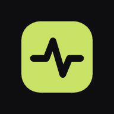

# FitPulse

### Train. Eat. Sleep. Repeat.

**One app for your whole fitness routine: nutrition, training, hydration, sleep and activity, tracked against targets calculated from your own body.**

[**🚀 Open the app**](https://fitpulse-ruddy.vercel.app) · [Screenshots](#-screenshots) · [Features](#-features) · [Tech stack](#-tech-stack) · [Run locally](#-getting-started) · [API](#-api-reference)


<br/>

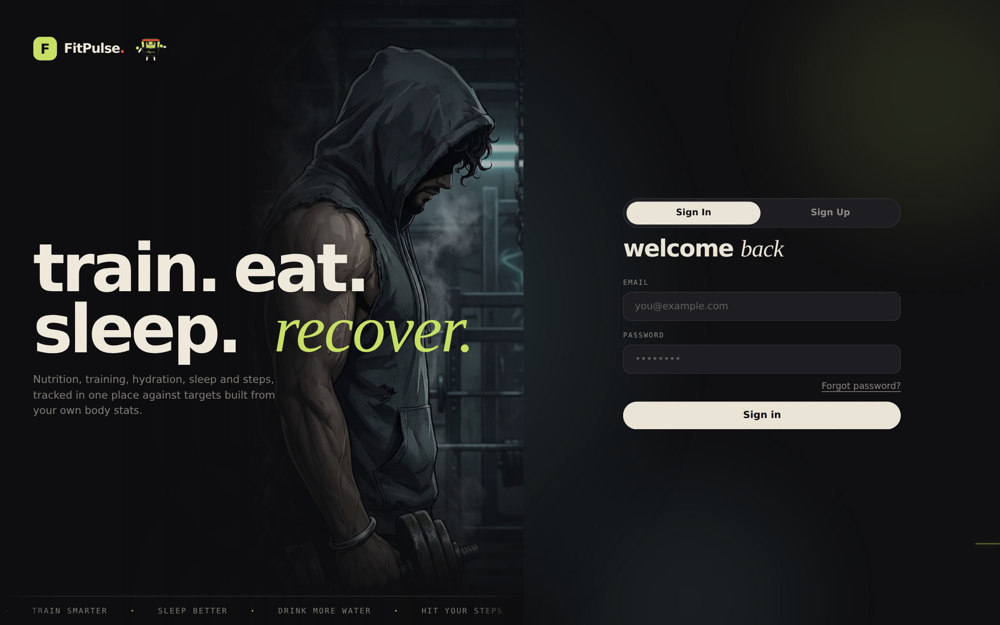

</div>

---

## ✨ Why FitPulse

Most fitness apps make you juggle five different trackers. FitPulse puts everything in one place and personalises it. Enter your body stats once, and every target you see (calories, macros, water, steps, sleep) is built from **your** numbers, not generic defaults.

- 🎯 **Personal by default.** Calorie and macro targets come from your age, height, weight, activity level and goal.
- 📈 **Progress you can see.** Every metric has 7-day and 30-day views.
- 🏋️ **Training that fits your life.** Pick your workout days and the program adapts to your goal and diet.
- 🎧 **Built for the workout itself.** In-app exercise demos and a full music player with Spotify and YouTube.
- 📱 **Install it like an app.** Add it to your home screen on iPhone or Android and it opens full-screen.
- 🌗 **Light and dark mode.** Follows your system setting, or switch with one tap.
- 🟢 **Meet Pulse.** Our gym-bro mascot jogs, lifts, sips and snoozes across the app.
- ✨ **A landing page that moves.** Full-body hero artwork, rising headline and mouse parallax.

---

## 📸 Screenshots

<div align="center">

<table>
  <tr>
    <td align="center" width="50%">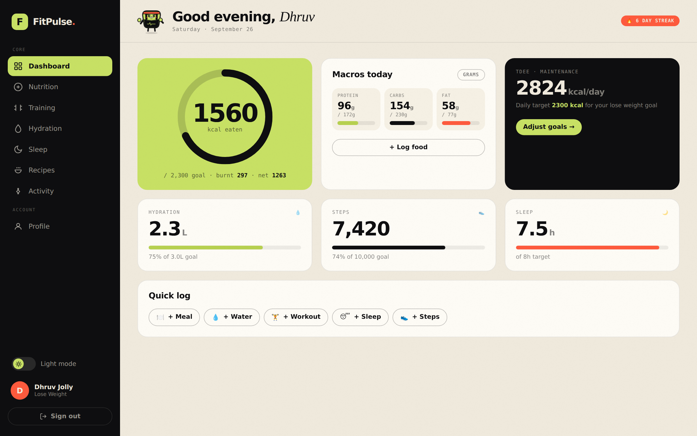<br/><b>Dashboard</b> · your whole day at a glance</td>
    <td align="center" width="50%">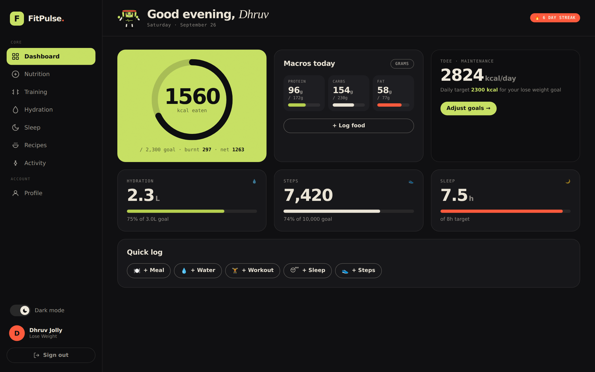<br/><b>Dark mode</b> · dashboard</td>
  </tr>
  <tr>
    <td align="center" width="50%">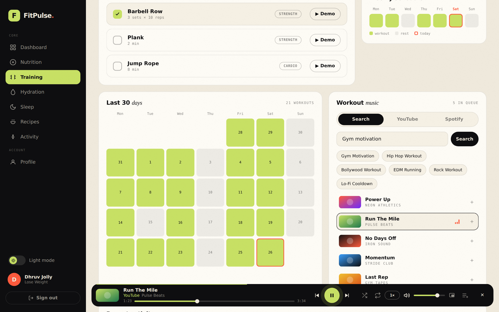<br/><b>Training</b> · 30-day calendar, demos and music player</td>
    <td align="center" width="50%">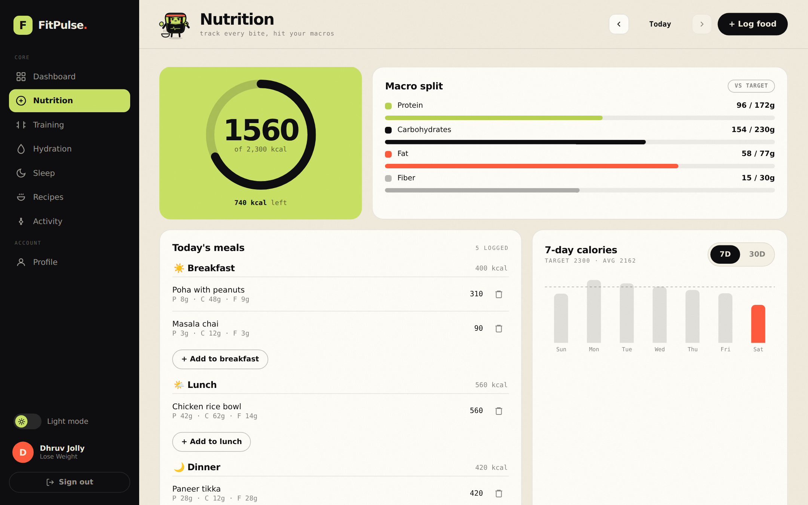<br/><b>Nutrition</b> · calories, macros and meal log</td>
  </tr>
  <tr>
    <td align="center">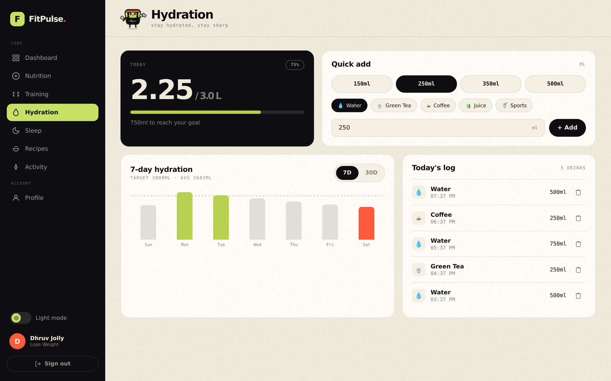<br/><b>Hydration</b> · quick-add and 7/30-day trends</td>
    <td align="center">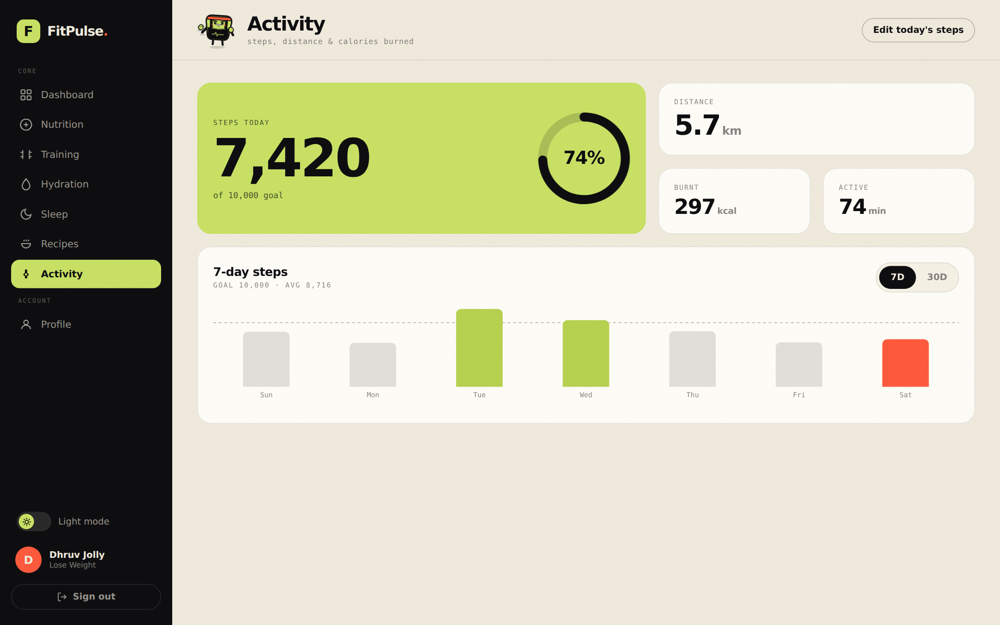<br/><b>Activity</b> · steps, distance and burn</td>
  </tr>
  <tr>
    <td align="center" colspan="2">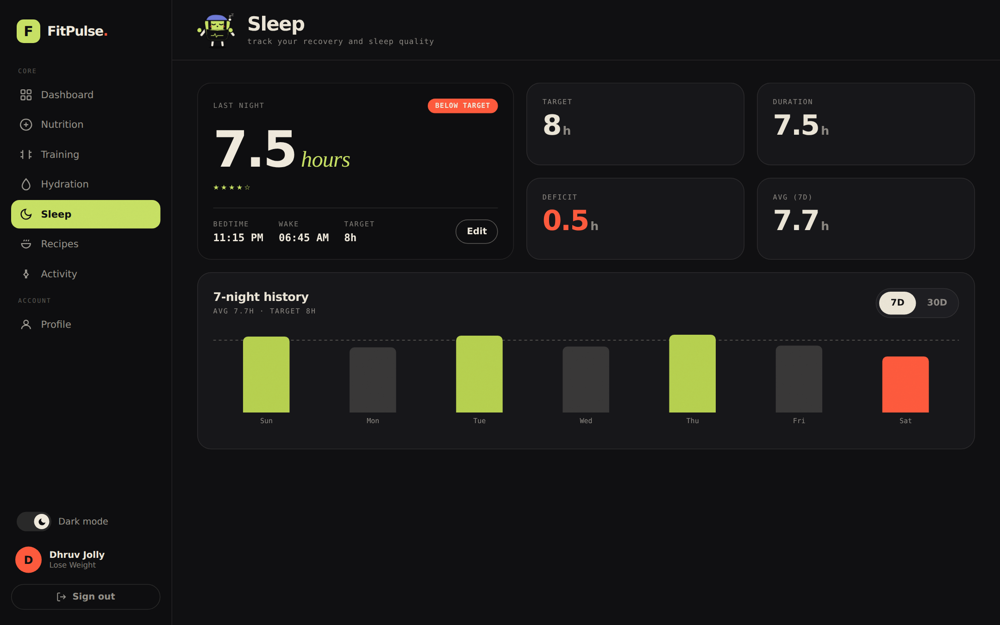<br/><b>Dark mode</b> · sleep</td>
  </tr>
</table>

### On your phone

<table>
  <tr>
    <td align="center">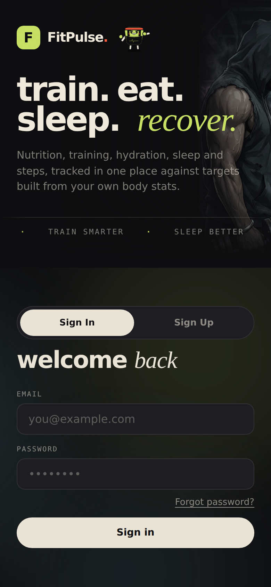<br/>Sign in</td>
    <td align="center">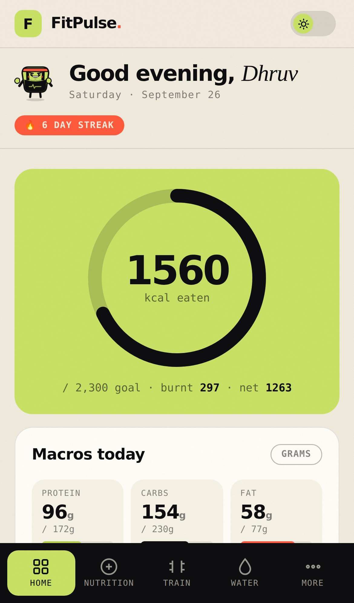<br/>Dashboard</td>
    <td align="center">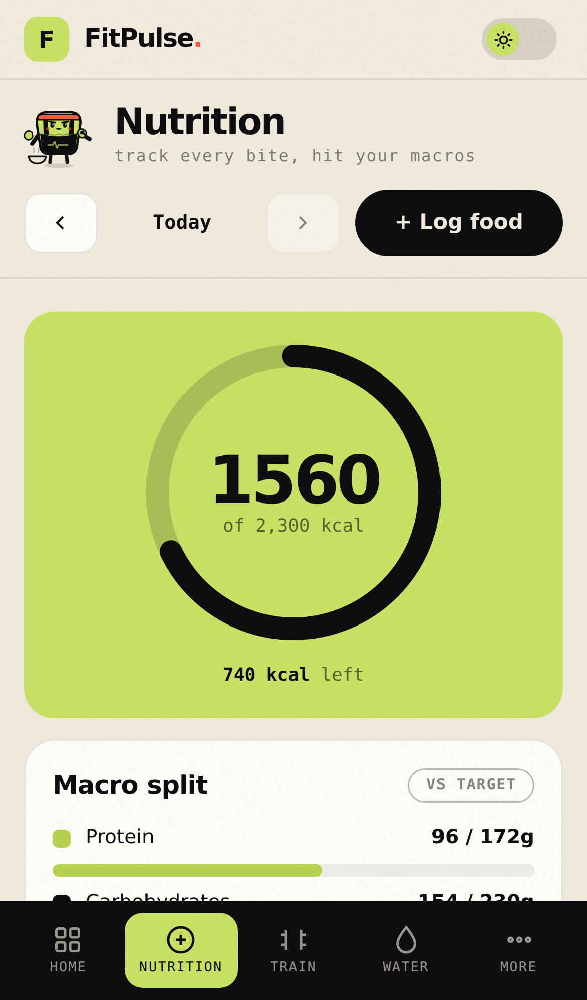<br/>Nutrition</td>
    <td align="center">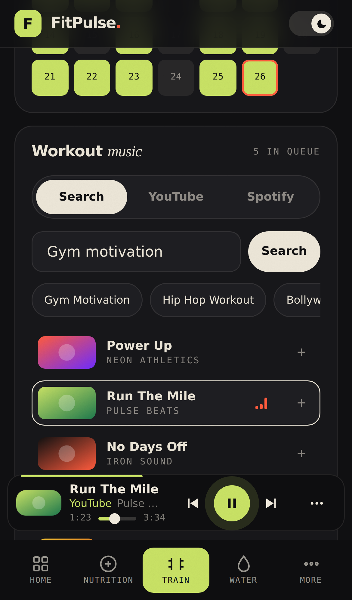<br/>Training + music</td>
    <td align="center">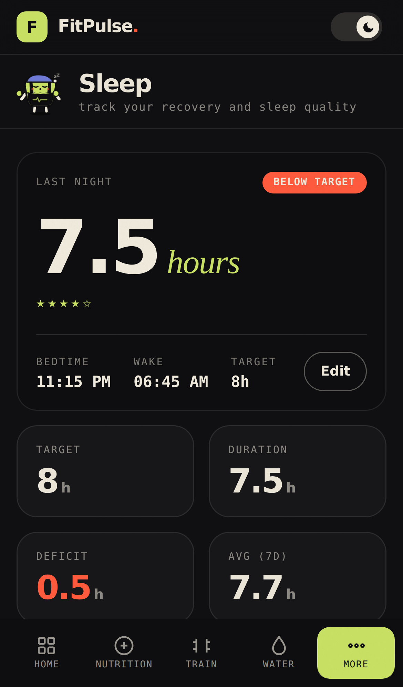<br/>Sleep</td>
  </tr>
</table>

### Pulse, the gym-bro mascot

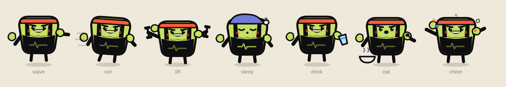

<sub>Sweatband, tank top with the FitPulse heartbeat, V-taper and biceps. Wave · run · lift · sleep · drink · eat · cheer. Pulse appears on the loading screen, in every page header and on empty screens.</sub>

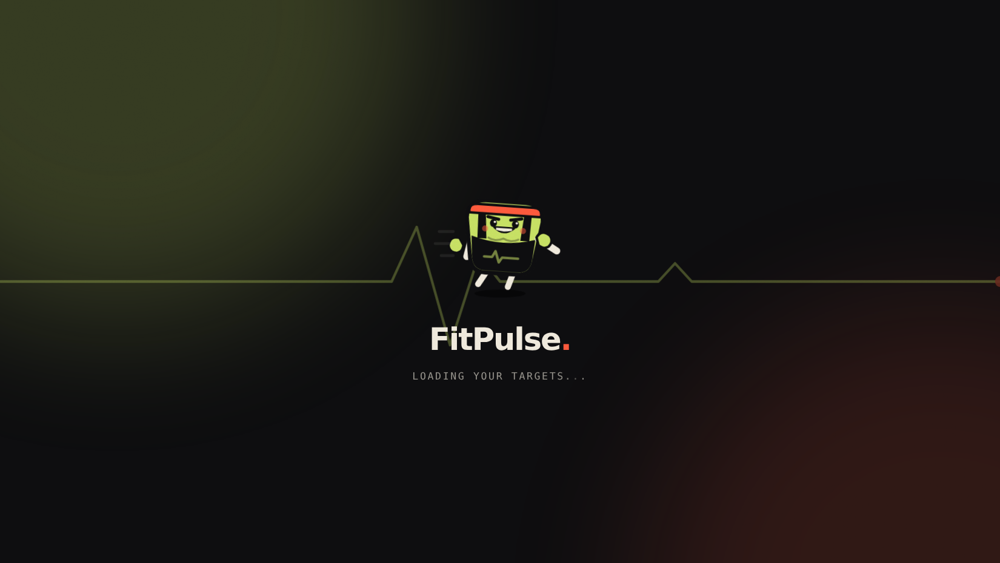

<sub>Animated loading screen: Pulse jogs along the heartbeat line.</sub>

<sub>Screenshots use sample data.</sub>

</div>

---

## 🧩 Features

### ✨ Landing and sign-in
- Full-body gym artwork with a slow cinematic zoom
- Headline words rise in one by one, and the last word cycles: *repeat → recover → rise*
- **Parallax:** the artwork, headline, form and the smoke, glow and heartbeat backdrop all move with your mouse at different depths
- Sign in / sign up toggle, Google sign-in and forgot password, all on one page
- Motion switches off when the system's reduced-motion setting is on

### 📊 Dashboard
Your day at a glance: calorie ring, macro progress, hydration, steps, sleep, TDEE, quick-log shortcuts and your workout streak.

### 🍽️ Nutrition
- Log food by meal: breakfast, lunch, dinner, snacks, pre/post-workout
- Quick-pick foods plus custom entries with full macros
- Live **protein / carbs / fat / fiber** progress against your targets
- Calorie trends over **7 or 30 days**

### 🍳 Recipes
- Browse by cuisine (Indian, Chinese, Italian, Mexican, Thai and more) or search by name
- Vegetarian and vegan collections surface automatically for veg and vegan diets
- Full ingredient lists, step-by-step method and video links

### 🏋️ Training
- **Personalised programs** built from your goal and diet, on the days you pick
- Push / pull / legs / core splits for muscle gain
- Tap-to-complete exercise checklist, plus workout, rest and off-day logging
- 🔥 Streak tracking and a **30-day consistency calendar**
- ▶️ **Demo videos** for every exercise, playing inside the app

### 🎧 Music player
- **Search** any song or pick a workout mood (Gym motivation, Bollywood workout, EDM running…)
- **Your YouTube / YouTube Music playlists** via Google sign-in
- **Spotify**: playlists, Liked Songs and search (needs Spotify Premium)
- Play / pause, next / previous, seek, volume, **mute, speed, shuffle, repeat** and an **Up next** queue
- Keeps playing while you move between pages
- **Pop-out player** that floats over other apps (Chrome / Edge desktop), plus keyboard media keys and lock-screen controls

### 💧 Hydration
One-tap quick-adds, drink types (water, green tea, coffee, juice, sports drinks), and daily and monthly trends.

### 😴 Sleep
Log bedtime and wake time, and duration is calculated for you. Rate sleep quality and track your average over 7 or 30 nights.

### 👟 Activity
Step logging with auto-calculated distance, calories burned and active minutes, with a progress ring against your daily goal.

### 👤 Profile and goals
- Goals: **lose weight · maintain · build muscle · endurance**
- Diets: **non-veg · veg · vegan · keto · paleo**
- **Automatic TDEE** (Mifflin-St Jeor) and **macro split** (30% protein · 40% carbs · 30% fat)
- Custom daily targets for water, steps and sleep

### 🔐 Accounts
- Email and password sign-up with secure JWT sessions
- **Sign in with Google**
- **Forgot password** with a secure one-time email link
- Rate-limited sign-in, sign-up and reset endpoints to block brute-force attempts

### 📱 App experience
- **Installable (PWA)**: home-screen icon, full-screen launch, offline-ready shell and an install banner
- **Light / dark mode** with a smooth cross-fade
- **Animated loading screen** and **Pulse** the mascot on every page
- **Fast first load:** if the free-tier API is still waking up, the app stops waiting after 20 seconds instead of hanging
- Dates roll over at midnight on their own, even if the app stays open
- Phone-first layout: bottom tab bar, "More" sheet, bottom-sheet dialogs and no zoom-on-tap
- **Animated favicon** that pulses on sign-in, sign-out and while you use the app

---

## 🛠 Tech Stack

| Layer | Technology |
|---|---|
| **Frontend** | React 18 · React Router v6 · Recharts · date-fns · Axios |
| **Styling** | Custom CSS design system (no UI framework) · light/dark themes · CSS animations · SVG mascot · Bricolage Grotesque, Instrument Serif, Inter Tight, JetBrains Mono |
| **Backend** | Node.js · Express 4 · express-validator · Morgan |
| **Database** | MongoDB Atlas · Mongoose |
| **Auth and security** | JWT · bcrypt · Google Identity Services · SHA-256 hashed reset tokens · rate limiting · CORS allowlist · central error handling |
| **Integrations** | YouTube Data API v3 · YouTube IFrame Player API · Spotify Web API + Web Playback SDK (OAuth PKCE) · TheMealDB · Nodemailer (SMTP) |
| **Browser APIs** | Service Worker · Web App Manifest · Media Session · Document Picture-in-Picture |
| **Testing** | Node test runner API suite (auth, profile, logs, rate limits) |
| **Hosting** | Vercel (frontend) · Render (API) |

**Highlights**
- **Responsive.** Full sidebar on desktop, icon rail on tablets, bottom tab bar on phones.
- **Validated API.** Every request is validated, and errors come back in one consistent format.
- **Privacy-minded.** Passwords are hashed, reset tokens are stored only as hashes, and the reset flow never reveals whether an email is registered.
- **Resilient integrations.** Third-party responses are cached, and every optional integration can be switched off without breaking the app.
- **Accessible motion.** Animations turn off when the system's reduced-motion setting is on.

---

## 🚀 Getting Started

**Prerequisites:** Node.js 18+ and MongoDB (local or [Atlas](https://www.mongodb.com/atlas)).

```bash
git clone https://github.com/dhruvJolly-3/fitpulse.git
cd fitpulse

npm install
npm run install:all

cp server/.env.example server/.env   # add MONGODB_URI and JWT_SECRET

npm run dev
```

| Service | URL |
|---|---|
| App | http://localhost:3000 |
| API | http://localhost:5001 |
| Health check | http://localhost:5001/api/health |

### Environment variables

**Server**

| Variable | Required | Purpose |
|---|:---:|---|
| `MONGODB_URI` | ✅ | MongoDB connection string |
| `JWT_SECRET` | ✅ | Signs login tokens |
| `CORS_ORIGINS` | | Allowed frontend URLs |
| `APP_URL` | | Frontend URL for reset emails |
| `SMTP_HOST` `SMTP_PORT` `SMTP_USER` `SMTP_PASS` `MAIL_FROM` | | Password-reset email |
| `GOOGLE_CLIENT_ID` | | Google sign-in |
| `YOUTUBE_API_KEY` | | Music search and in-app exercise videos |
| `MEALDB_API_KEY` | | Recipes (free test key by default) |

**Client**

| Variable | Purpose |
|---|---|
| `REACT_APP_API_URL` | Backend URL |
| `REACT_APP_GOOGLE_CLIENT_ID` | Google sign-in and YouTube playlists |
| `REACT_APP_SPOTIFY_CLIENT_ID` | Spotify login and playback |

> Optional integrations stay off until their keys are set, so the app runs fully without them.

### Running the tests

The API test suite uses a separate database so it never touches real data:

```bash
cd server
TEST_MONGODB_URI=mongodb://localhost:27017/fitpulse_test npm test
```

---

## 🗂 Project Structure

```
fitpulse/
├── server/
│   ├── models/        User · NutritionLog · Training · Metrics
│   ├── routes/        auth · user · nutrition · training · water · sleep
│   │                  steps · goals · recipes · videos
│   ├── middleware/    JWT auth · validation · rate limiting · error handling
│   ├── tests/         API test suite
│   └── utils/         mailer · cache · async handler
│
├── client/
│   ├── public/        manifest · service worker · app icons
│   └── src/
│       ├── pages/       Dashboard · Nutrition · Recipes · Training · Water
│       │                Sleep · Steps · Profile · Onboarding · Auth
│       ├── components/  AuthHero · Pulse (mascot) · Splash · MiniPlayer · MusicPanel
│       │                PopoutPlayer · Ring · WeekBars · MonthCalendar
│       │                ExerciseVideoModal · GoogleButton · InstallPrompt
│       ├── music/       YouTube player · Spotify · YouTube playlists
│       ├── context/     Auth + API client · theme (light/dark)
│       └── index.css    Design system, themes and motion
│
└── docs/screenshots/  README images
```

---

## 🔌 API Reference

All endpoints except auth and health need `Authorization: Bearer <token>`.

| Method | Endpoint | Description |
|---|---|---|
| `POST` | `/api/auth/register` · `/login` · `/google` | Sign up / sign in |
| `POST` | `/api/auth/forgot-password` · `/reset-password` | Password reset |
| `GET` `PUT` | `/api/user/profile` | Profile + auto TDEE and macros |
| `GET` `POST` `DELETE` | `/api/nutrition/:date` · `/:date/food` | Food log |
| `GET` | `/api/nutrition/summary/week?startDate=&days=` | Calorie history |
| `GET` `POST` `PUT` | `/api/training/programs` | Training programs |
| `GET` `POST` | `/api/training/logs` · `/streak` | Workouts and streak |
| `GET` `POST` | `/api/water` · `/api/sleep` · `/api/steps` | Daily metrics |
| `GET` | `/api/{water,sleep,steps}/history/week?startDate=&days=` | 7–30 day history |
| `GET` | `/api/recipes/search` · `/api/recipes/:id` | Recipes |
| `GET` | `/api/videos/search?q=` · `/api/videos/music?q=` | Exercise videos and music search |
| `GET` | `/api/health` | Service status |

---

## 🗺 Progress and roadmap

**Shipped**
- [x] Nutrition, training, hydration, sleep and activity tracking with automatic targets
- [x] New design system, then motion, 30-day history and recipes
- [x] Google sign-in and password reset
- [x] Installable app (PWA) with mobile-first layout
- [x] In-app music player (YouTube, YouTube playlists, Spotify), pop-out player and media controls
- [x] In-app exercise demo videos
- [x] Light / dark mode
- [x] Animated loading screen, animated favicon and Pulse the mascot
- [x] Animated landing page with hero artwork and mouse parallax
- [x] Pulse redesigned as a gym bro
- [x] Auth rate limiting, midnight date rollover and an API test suite
- [x] Faster first load when the API is cold-starting

**Next**
- [ ] Google Health / Fitbit sync (steps, sleep, workouts)
- [ ] Large food database with barcode scanning and photo logging
- [ ] Daily weight log with trend chart
- [ ] Smart reminders via push notifications
- [ ] Progress photos

---

<div align="center">

**Built by [Dhruv Jolly](https://github.com/dhruvJolly-3)**

</div>
